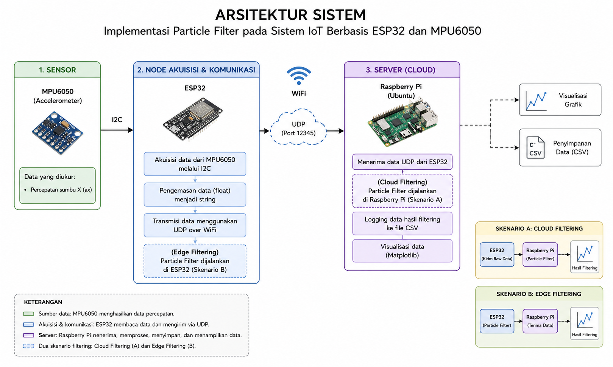
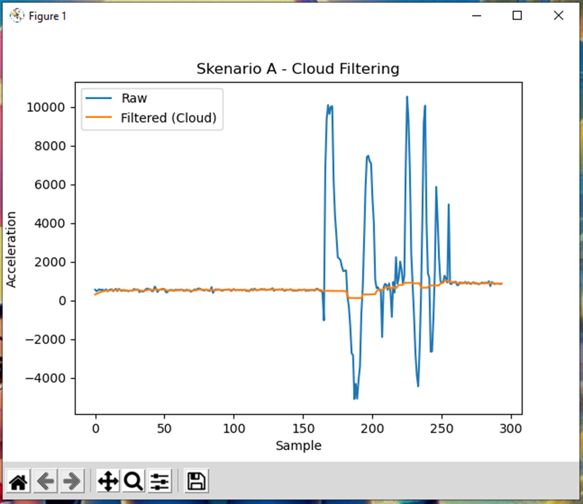
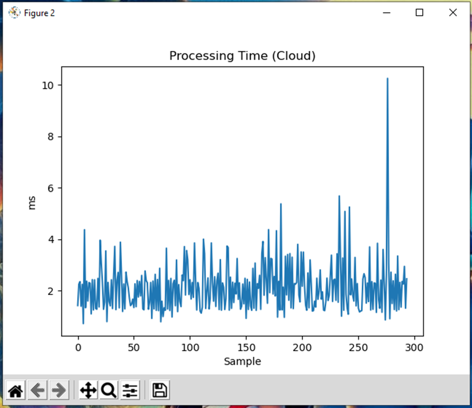
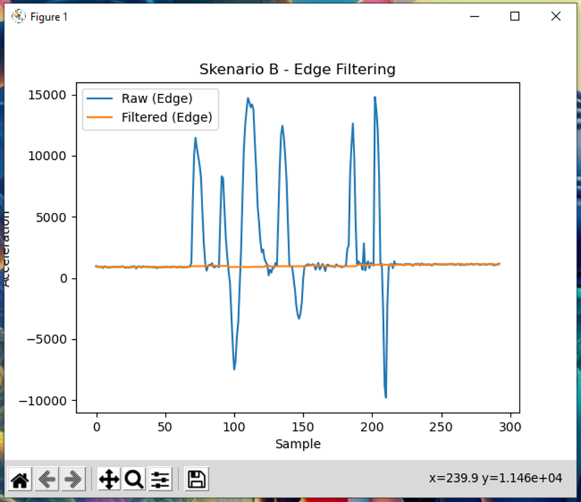
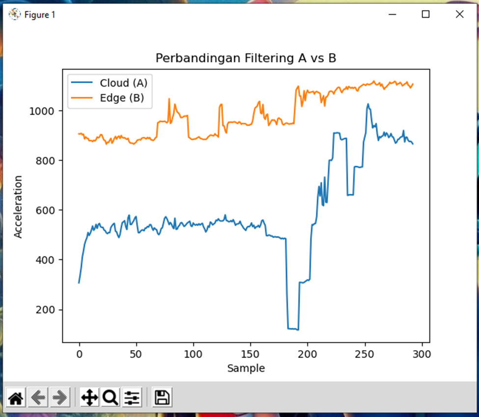

# 📡 IoT Particle Filter: Cloud vs Edge Computing

Implementasi **Particle Filter** pada sistem IoT berbasis **ESP32 dan MPU6050** untuk mereduksi noise sensor serta membandingkan performa antara pendekatan **Cloud Computing** dan **Edge Computing**.

---

## 👨‍🎓 Project Information

* **Author**: Sri Kusmiyati
* **Course**: Sistem Berbasis Mikroprosesor
* **Supervisor**: Muhammad Qomaruz Zaman, S.T., M.T., Ph.D.

📄 Full Report: [`docs/laporan.pdf`](docs/laporan.pdf)
🎥 Demo Video: (https://youtu.be/MSb_ykKuS6w)
🔗 GitHub Repo:(https://github.com/SKusmiyati/iot-particle-filter)

---

## 🎯 Project Overview

Penelitian ini bertujuan untuk:

* Mereduksi noise pada data sensor MPU6050
* Mengimplementasikan Particle Filter pada sistem IoT
* Membandingkan performa:

  * **Cloud Filtering (server-based)**
  * **Edge Filtering (device-based)**

Particle Filter dipilih karena efektif untuk sistem **non-linear dan non-Gaussian**.

---

## 🧠 System Architecture



### Komponen Sistem:

* **MPU6050** → Sensor percepatan
* **ESP32** → Akuisisi data + komunikasi WiFi
* **Raspberry Pi** → Server pemrosesan & visualisasi

---

## ⚙️ Scenario Design

### 🔵 Scenario A – Cloud Filtering

MPU6050 → ESP32 → RAW data → Raspberry Pi → Particle Filter

* Filtering dilakukan di server
* Lebih fleksibel (komputasi besar)
* Bergantung pada jaringan

---

### 🟠 Scenario B – Edge Filtering

MPU6050 → ESP32 → Particle Filter → Raspberry Pi

* Filtering dilakukan di ESP32
* Lebih cepat dan efisien
* Resource terbatas

---

## 📊 Results

### Cloud Filtering



### Processing Time



### Edge Filtering



### Comparison



---

## 📈 Key Findings

* Particle Filter berhasil mereduksi noise secara signifikan
* **Edge Filtering**:

  * Lebih stabil
  * Lebih hemat bandwidth
  * Latency lebih rendah
* **Cloud Filtering**:

  * Lebih fleksibel
  * Cocok untuk komputasi kompleks

---

## ⚡ Performance

* ⏱️ Rata-rata processing time (cloud): **< 1 ms**
* 📉 Noise reduction: signifikan pada kedua skenario
* 📡 Edge lebih efisien dalam komunikasi data

---

## 🧮 Particle Filter Algorithm

Tahapan utama:

1. Initialization
2. Prediction
3. Update (weighting)
4. Resampling
5. Estimation

---

## 💻 Installation

Install dependency di Raspberry Pi / Linux:

```bash
pip install numpy matplotlib
```

---

## ▶️ How to Run

### 1. Upload ke ESP32

* Gunakan Arduino IDE
* Pilih:

  * `udp_cloud_raw.ino`
  * `udp_edge_pf.ino`

### 2. Jalankan Receiver di Raspberry Pi
Cloud Filtering
```bash
python3 udp_cloud_pf.py
```
Edge Filtering
```bash
python3 udp_edge_log.py
```
### 3. Visualisasi Data
Skenario A
```bash
python3 plot_A.py
```
Skenario B
```bash
python3 plot_B.py
```
Perbandingan Skenario A dan B
```bash
python3 plot_final.py
```
---

## ⚠️ Challenges

* UDP tidak menjamin keutuhan data (packet loss)
* Keterbatasan memori ESP32
* Sinkronisasi data antar skenario
* Interpretasi hasil grafik filtering

---

## 🧠 Skills Gained

* IoT System Design (ESP32)
* Particle Filter Implementation
* UDP Communication
* Data Processing (NumPy, Matplotlib)
* Edge vs Cloud Computing Analysis

---

## 📚 References

1. Arulampalam et al., IEEE Transactions, 2002
2. Shi et al., Edge Computing, IEEE, 2016
3. Satyanarayanan, Edge Computing, 2017

---

## 🔗 Future Work

* Perbandingan dengan Kalman Filter
* Dashboard real-time (Web / IoT Platform)
* Integrasi MQTT / Cloud IoT

---

## ⭐ Support

Jika project ini membantu, silakan beri ⭐ pada repository ini.

---
